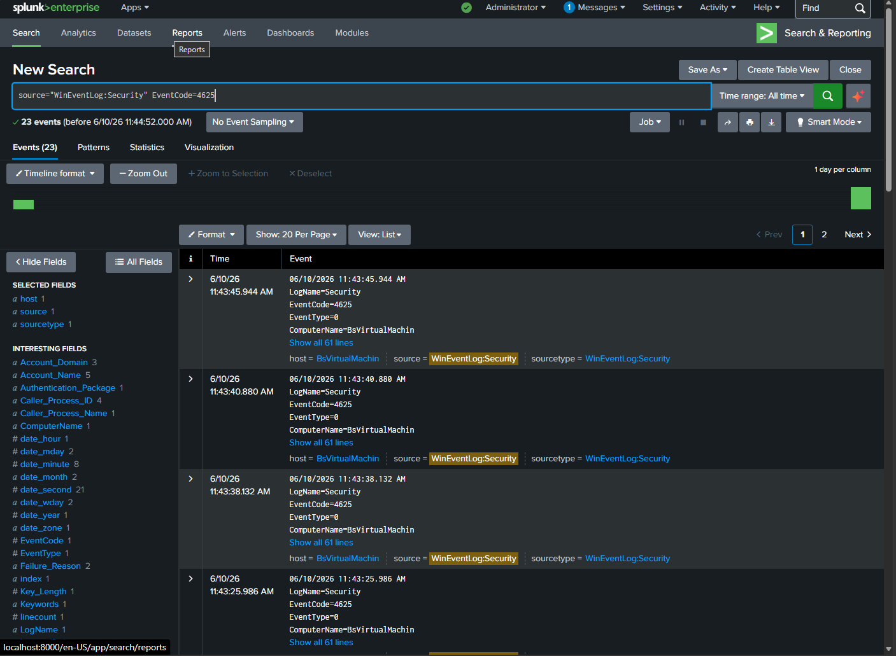
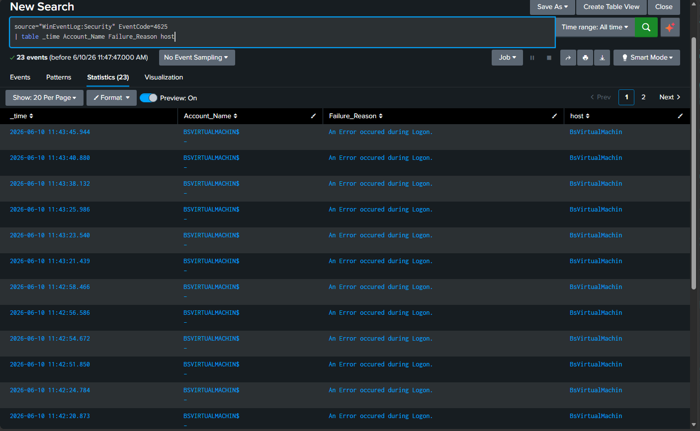
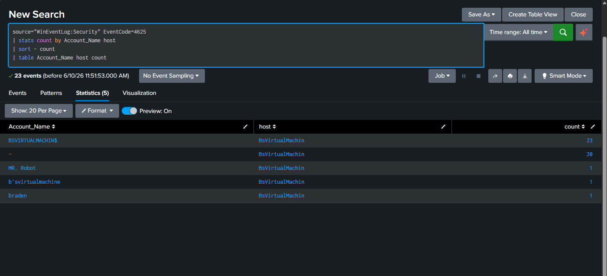
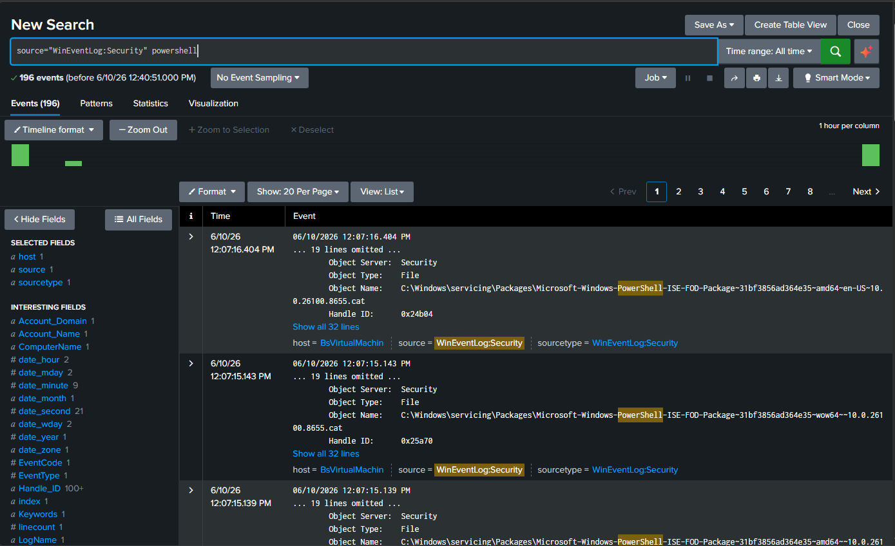
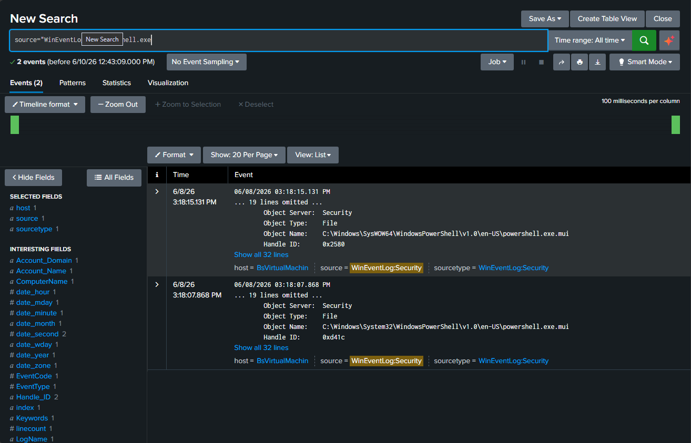
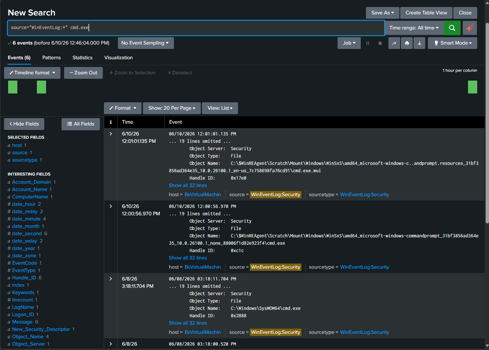

# Splunk Detection Engineering & Threat Hunting Lab

---

# Overview

This project focused on hands-on threat hunting and detection engineering using Splunk SIEM within a simulated Windows enterprise environment.

During the investigation, I analyzed authentication logs, PowerShell activity, and Windows security telemetry to identify suspicious behavior, correlate indicators of compromise (IOCs), and develop SPL-based detection logic.

The investigation followed a SOC-style workflow centered around:

- Log analysis
- Event correlation
- Threat hunting
- Detection engineering
- MITRE ATT&CK mapping

---

# Objectives

- Investigate suspicious activity using Splunk SPL queries
- Identify failed login and brute force patterns
- Analyze suspicious PowerShell execution
- Correlate indicators of compromise (IOCs)
- Review Windows authentication and process telemetry
- Develop detection-focused SPL queries
- Map observed behavior to MITRE ATT&CK techniques
- Document investigation findings and remediation recommendations

---

# Tools Used

- Splunk Enterprise
- SPL (Search Processing Language)
- Windows Event Logs
- Sysmon
- Windows Security Logs
- MITRE ATT&CK Framework
- Virtual Machine Environment

---

# Lab Environment

- Windows-based virtual machine environment
- Splunk SIEM configured for log ingestion
- Windows authentication and process telemetry enabled
- Simulated enterprise-style logging environment

---

# Investigation Areas

## Authentication Analysis

- Failed login analysis
- Suspicious authentication investigation
- Brute force activity detection

## PowerShell & Process Analysis

- Suspicious PowerShell execution analysis
- Encoded command investigation
- Parent-child process analysis

## Threat Hunting & IOC Correlation

- IOC identification and validation
- Event correlation and timeline analysis
- Suspicious activity investigation

---

# Planned Investigation Workflow

## 1. Initial Detection

- Review ingested authentication and process logs
- Identify suspicious activity patterns within Splunk

## 2. Threat Hunting & SPL Analysis

- Develop SPL queries for suspicious activity detection
- Investigate PowerShell and authentication events
- Correlate suspicious indicators across log sources

## 3. Event Correlation & Findings

- Correlate authentication and process telemetry
- Validate suspicious behavior and IOC activity
- Document investigation findings

---

# MITRE ATT&CK Mapping

- T1110 — Brute Force
- T1059.001 — PowerShell
- T1087 — Account Discovery
- T1055 — Process Injection

---

# Screenshots

### Splunk Data Ingestion

### Failed Login Events

### Failed Login Investigation Table

### Brute Force Detection Query

### PowerShell Activity Detection

### Encoded PowerShell Hunting

### Suspicious Process Analysis

### MITRE Technique Correlation

---

# Skills Demonstrated

- Threat Hunting
- SIEM Investigation
- Detection Engineering
- SPL Query Development
- IOC Correlation
- Windows Log Analysis
- Security Event Analysis
- MITRE ATT&CK Mapping
- Incident Documentation
